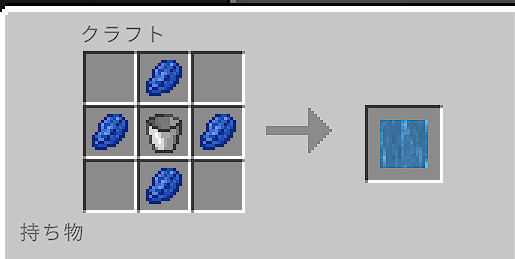

# 5.11.0 マイナーバージョン

## Change logs
今回のアップデートはPocketMine-MPソフトウェアのアップデートに伴い、PocketMine-MP3からPocketMine-MP4に対応させることを目的としています また、change
logには書き漏れがあると思われます。ご了承ください。
## System関係

* 一部主要Formにアイコンが追加されました。
* elevatorがすべてのワールドで使用可能になりました。また、elevatorの高さ制限などを削除しました。
* DirectInventoryの処理を変更しました。これにより、採掘した1tick以内(0.05秒)にログアウトしたとき落ちる致命的なエラーが修正されました。
* AntiCheatSystemを一新しました。詳細はありません。
* いくつかのブロックが対応されなくなりました。これにより一部ブロックがtile.info_update.nameなどに置換されます。また、updateブロックを破壊したときネザースターがドロップします。
* かなとこやエンチャントテーブルなどのUIがあるブロックをタップしたときに稀にUIが表示されるバグを修正しました。
* 無駄な処理を削減して人工資源の処理をかなり軽量化しました。
* かまど保護機能を削除しました
* チェストショップを一新したため旧チェストショップが使用不可になります。作成しなおすことで解決します。
* トライデントが削除されました。代替品などは存在しません。
* ネザライトのツールを作成する手段制限され、vanillaのレシピを削除したことにより入手手段が完全にオリジナルレシピのみになりました。
* エリトラの耐久値が飛行では一切減らなくなりました。
* 骨粉を撒いたときにパーティクルが出るようになりました。
* 本来コマンド看板のみのメッセージがすべての看板で流れてしまうバグを修正しました。
* かなとこをタップしたときの判定をかなり増やした為、何が原因で修繕できないのかが一目でわかるようになりました。
* 土地保護斧の機能を削除しました。
* MiningLevelが上がったとき5で割れる数の場合discordにMessageが行くようになりました。
* 落下ダメージと窒息ダメージが発生する際にdamage判定を残すようにしていましたが、それらdamage判定を完全に削除しました。
* SpamBan機能を削除しました。
* 連続で同じ言葉をしゃべれなくする機能を削除しました。
* diceに上限を設定しました。これにより、一万以上の乱数は生成することは出来ません。
* コマンド記憶装置の動作をかなり変更しました。
* bonusconvertの動作を変更しました。ログインボーナスを持っていなくても内容を見ることが出来るようにしました。
* スポーン地点をロビーに変更しました。これにより/warp spawnの場所が不要になったため削除し、ルールには初期ログイン以外には強制的に移動することがなくなりました。
* 初期スポーンの際「利用規約本」というアイテムを渡すようにしました。
* 道具の残り耐久地が50を下回ったときにtitleでわかりやすく表示するようにしました。
* レベルが上がったときに表示されるtutorialメッセージの色を黄緑から金色(?)に変更しました。
* 死亡時所持金が100万以上の場合全体メッセージが出るようになりました。
* 今まで放置されまくっていた採掘エフェクト付与アイテムに機能を実装しました。
* Internal server errorがpmmp4になったことにより消滅したので必然的に「Logout >>
  playerがサーバーエラーになりサーバーを退出しました。サーバー管理者まで報告をお願いします。」というメッセージも消滅しました。
* サーバーの再起動時間を6時間から24時間に変更しました。また、再起動前(15分,5分,15秒,3秒,2秒,1秒)にメッセージが出るようになりました。
* アイテムの定期削除メッセージがなんかうざかったので削除されたアイテムがない場合はメッセージを出さないようにしました。

## Command

* `sta`コマンドを削除、`stinfo`コマンドに変更されました。formの追加と変更した際に記録が残るようになり、リログしても戻らないようになりました。
* `bonus`を`bonusconvert`に変更し、`bonusconvert`は非表示コマンドになりました。
* `bonusitems`を`bonuscollect`に変更し、`bonuscollect`は非表示コマンドになりました。
* `bonusconvert`と`bonuscollect`の機能をまとめた`bonus`コマンドを追加。
* `dice6`コマンドを削除。 (`dice`コマンドを代用してください。引数に1,6を入れることで簡単に再現が出来ます)
* 鉄のMiningToolをshopから削除。購入済みの方は引き続き利用可能ですが購入はできません。これにより`mt1`がIronではなくDiamondに繰り上げされ、`mt2`
  がDiamondからネザライトのマイニングツール購入コマンドになりました。また、`mt3`コマンド及び以前のネザライトツール購入コマンドを削除しました。
* 上記の変更によりMiningToolの種類が減ったため`mt`コマンドを削除し`shop`に組み込みする形となりました。
* `mt4`の権限を変更。`mt4`コマンドが鯖民にも見え、実行できる問題を修正。
* `xp`コマンドが鯖民にも見える問題を修正。
* `function`コマンドを削除。`information`に統一されました。
* `rule`コマンドを削除。`tos`コマンドに変更されました。
* `helps`コマンドを削除、コマンドリスト機能自体を削除しました。
* `coordinates`コマンドを追加。引数で座標表示のon/offができるようになりました。
* `st all`コマンドを削除。`stall`コマンドに変更されました。
* `startp`コマンドを削除、`s`コマンドに変更されました。
* `endp`コマンドを削除、`e`コマンドに変更されました。
* `s`と`e`コマンドもlandコマンドと同様に生活ワールド以外では実行できないようになりました。
* `en`を`ven`に変更し、`ven`は非表示コマンドになりました。
* `items`コマンドを削除、`en`コマンドに変更されました。
* `land`コマンド関係に大幅な機能追加、修正が行われました。
* `repair`コマンドを追加。80レベル以上でどこでも修繕ができるようになる代わりに修繕時に1500円の手数料がかかります。また、修理失敗率を大きく変更しました。下記の表が確立になります。

|     修理するときのレベル      | 修理失敗確率 |
|:-------------------:|:------:|
| (MiningLevel)10Lv未満 | 10％で破損 |
|    10Lv以上20Lv未満     | 9％で破損  |
|    20Lv以上30Lv未満     | 8％で破損  |
|    30Lv以上40Lv未満     | 7％で破損  |
|    40Lv以上50Lv未満     | 6％で破損  |
|    50Lv以上60Lv未満     | 5％で破損  |
|    60Lv以上70Lv未満     | 4％で破損  |
|    70Lv以上80Lv未満     | 3％で破損  |
|    80Lv以上90Lv未満     | 2％で破損  |
|    90Lv以上100Lv未満    | 1％で破損  |
|       100Lv以上       |  破損無し  |

## World

* ロビーを変更。懐かしい人には懐かしいロビーになりました。また、今回の復刻で穴とかに落ちて抜けられなくなる場所があったため修正しました。以前と同様に上のエリアには引き続き行けるようになっていますので探してみてください。

## オリジナルレシピ

* 実装されたアイテムは以下の通りです
  * 不死のトーテム
  * レベルブロック
  * 精製水
  * マグマブロック
  * 金のハンドル
  * 燃料用マグマ
  * 魔剤x4
  * 魔剤x16
* 一部オリジナルレシピがクラフトガイドに追加されました

