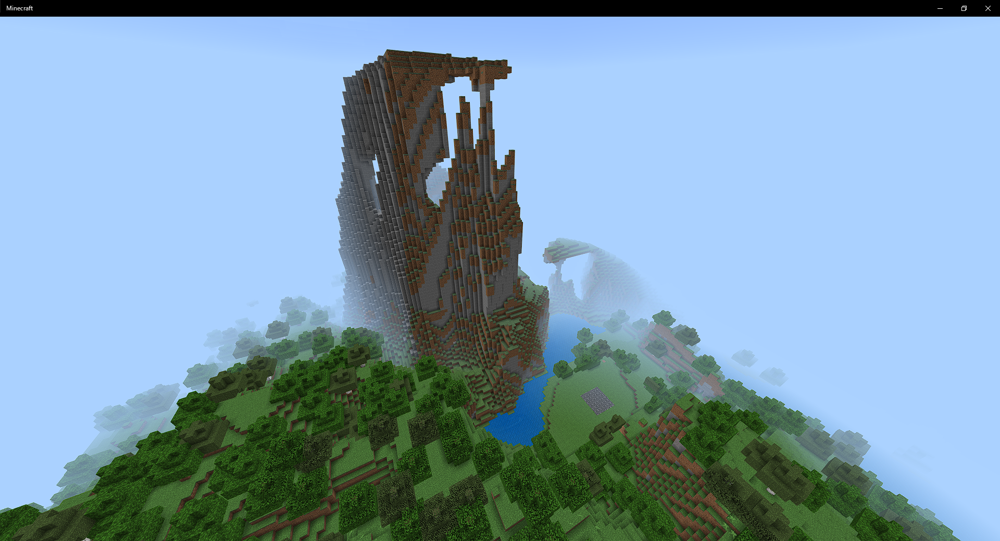
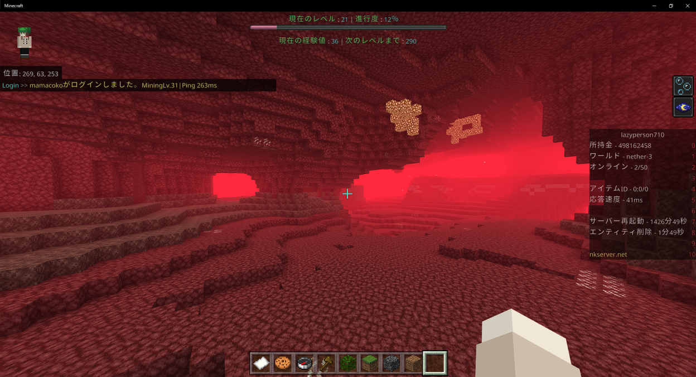
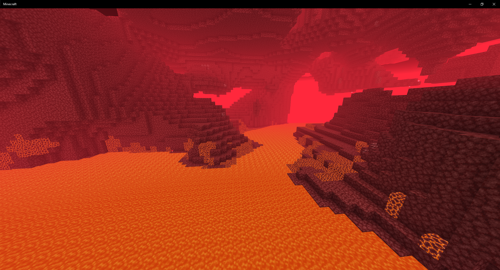

# 5.16.0 マイナーバージョン
## BugFix

* プレイヤーデータの頭を取得できるコマンドが実行できてしまう問題を修正しました
* アンチチート系の動作を多少変更しました

## その他機能変更

* MiningToolsの動作を理論上2倍近く軽量化しました
  * サーバー公開当初(去年の１０月)から比べると3倍近くの軽量化になります。やったね！
* BanSystemを一新しました
* ワールドを追加しました。追加したワールドはnature-3,4、nether-2,3になります
  * ワールドジェネレーターを変更した為、nature-4、nether-3はいつもと違うワールドとなっています
* その他バックグラウンド処理の変更など51fileの編集が行われました

