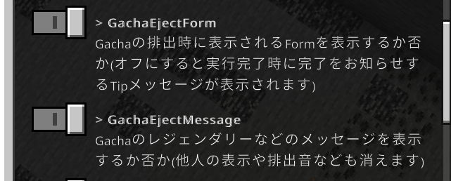

# 5.26.1 ビルドアップデート
## ゲームプレイ上の変更

* /bonusで取得出来るアイテムが一部使用出来ないバグを修正
  * 例 : コマンド記憶装置など
* /ticketからチケットの譲渡機能を廃止しました。
* 採掘時のticket付与に関する計算処理に誤りがあった為修正しました。
* MiningToolsに関する範囲破壊処理にかなりの修正を行いました。
* /settingで設定可能な項目が増えました。
  * がちゃの排出メッセージを他人のを含め全て非表示
  * がちゃの排出完了時に表示されるformを非表示
