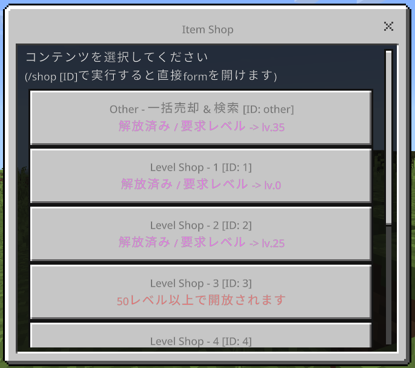
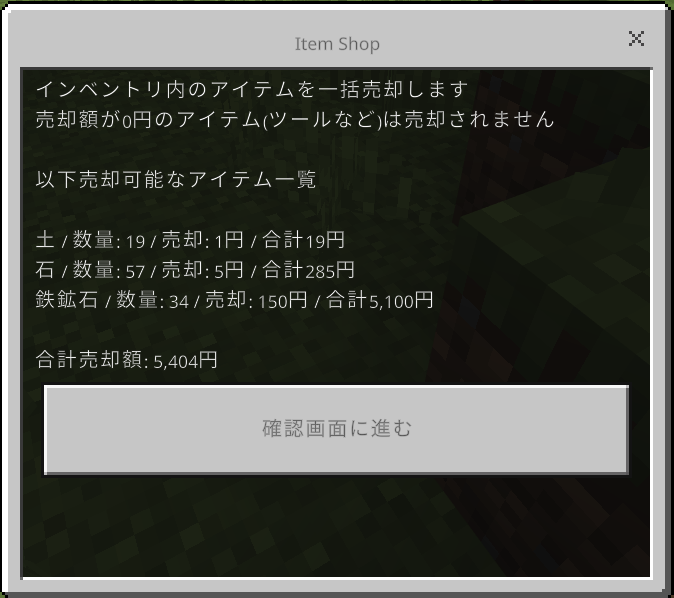
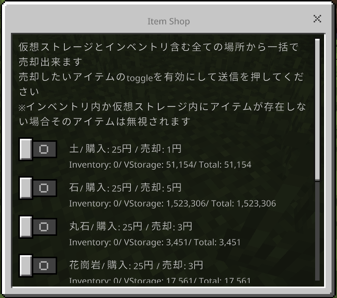
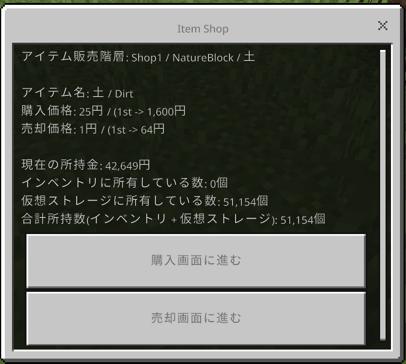

# 5.27.0 マイナーアップデート
## ゲームプレイ上の変更

* ワールドワープ時にワールドの解説が送信されるようになりました
* Settingsにあるワールドワープ時のメッセージに関する設定が正常に動作しない問題を修正しました
* Settingsの通常設定に関する説明を改修しました
* Shopを作り直しました
  * メッセージやフォームの内容が一部変更されました
  * カテゴリごとに一括売却が可能になりました
  * インベントリ内の一括売却で確認画面が削除されました
* nature-1のスポーン地点を変更しました(x224 ,z360からx0, z0)
* エンダーパールを使用することが出来るようになりました
* ガチャから排出される経験値ガチャを正常に使用できるようになりました
* マイニングツールではレベルブロックを破壊できないようになりました(範囲採掘部分)
* マイニングレベルランキングが31位まで表示されるバグを修正し30位までになりました
* 全てのブロックにおいて同一の経験値を得られるようになりました(1)
* 仮想ストレージの表示システムを変更しました

